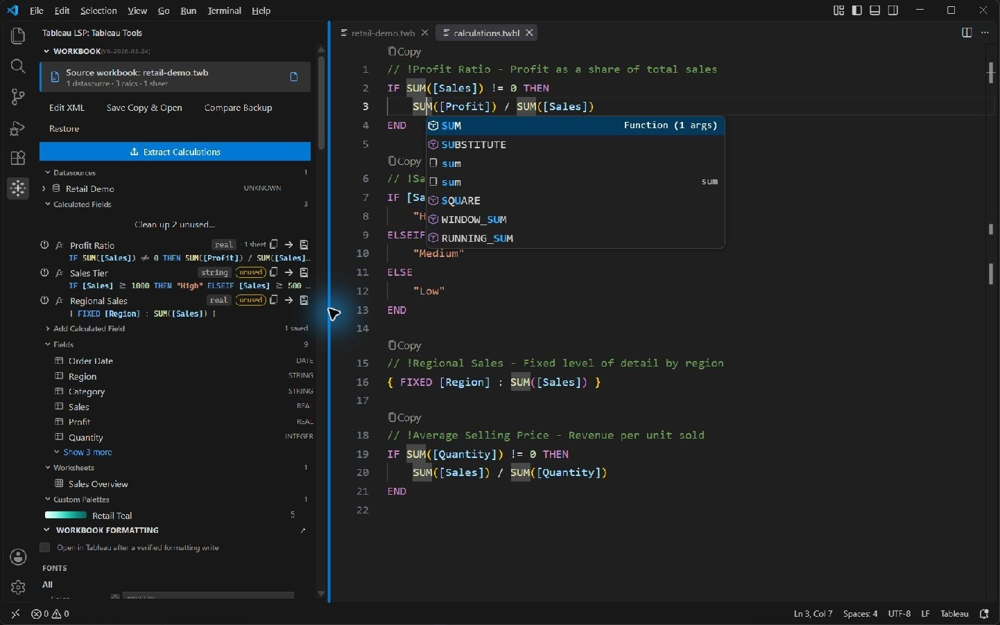
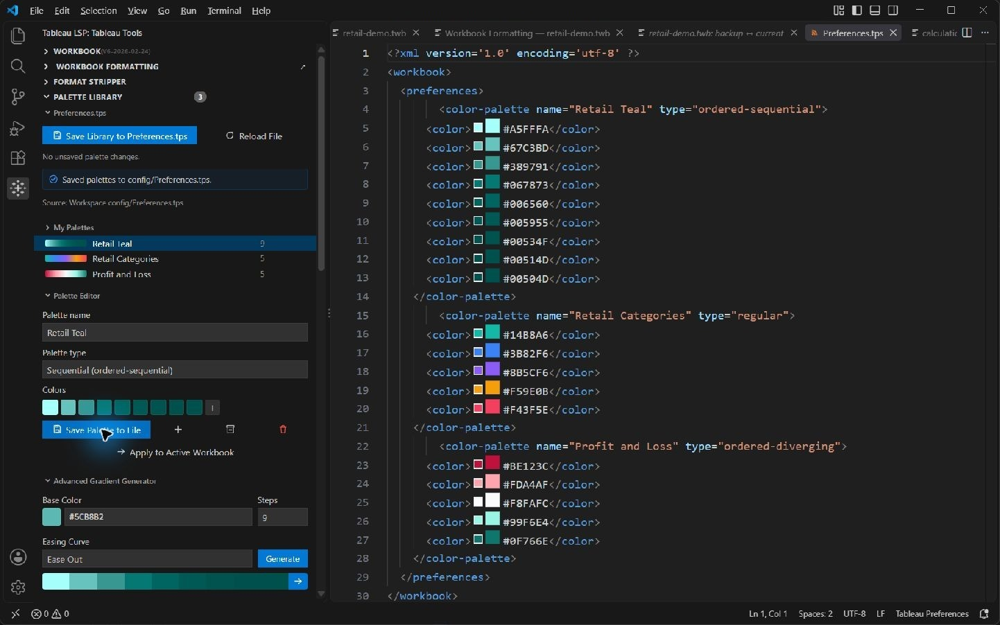

# Tableau Language Support

Write Tableau calculations and inspect, edit, and style workbooks in VS Code.

[Download 1.14.1](https://github.com/TrueCrimeDev/Tableau-LSP/releases/tag/installer-1.14.1) · [User guide](docs/user-guide.md) · [Demo and screenshots](examples/README.md) · [Changelog](CHANGELOG.md)

## Get started

Requires **VS Code 1.95+**. Download the GitHub `.vsix`, then run **Extensions: Install from VSIX…** to install **Tableau Language Support** by **TrueCrimeAudit**.

1. Open a folder containing a `.twb` or `.twbx` workbook.
2. Select **Tableau LSP** in the activity bar to open **Tableau Tools**.
3. Open a `.twbl` file for calculation completion, hover help, diagnostics, and formatting.

Editing and exporting files needs no Tableau account. Check the results on your [Tableau work computer](docs/user-guide.md#install-on-your-tableau-work-computer), or start with the [synthetic demo](examples/README.md#open-the-demo).

The [Marketplace listing](https://marketplace.visualstudio.com/items?itemName=TrueCrimeAudit.tableau-language-support) served 1.5.8 at the September 19 release check because Microsoft's publisher service blocked the update. Use the GitHub VSIX for 1.14.1.

## Features

| Workflow | Tools |
| --- | --- |
| Calculate | Function and field completion, signatures, diagnostics, snippets, formatting, and Calc Bank. |
| Inspect | Browse datasources, fields, calculations, and worksheets; extract calculations and workbook metadata. |
| Edit | Add calculated fields, edit packaged XML, save copies, compare backups, and restore changes. |
| Style | Edit fonts, borders, and colors; generate palettes; strip formatting; import and export themes. |
| Ask Copilot | Use `@tableau` to inspect, calculate, edit XML, or export. Requires Chat and model access. |

## See it working

Actual captures of the released **1.14.0** extension.





[Walk through extraction, formatting, backups, and palettes →](examples/README.md)

## Editing and recovery

Workbook edits create timestamped `.tableau-lsp-backups` and verify the saved XML. Packaged `.twbx` edits preserve the other archive entries. **Save a Workbook Copy** exports a separate file. [Editing guide →](docs/user-guide.md#edit-and-recover-workbooks)

File checks do not validate Tableau rendering, connections, or calculation results. Verify those in Tableau Desktop. [Verification record →](docs/review-1.14.0.md)

## Development

```sh
npm ci
npm test
```

**F5** builds and launches an isolated demo. CI also tests the installed VSIX. [Debugging](docs/AUTO_RELOAD_DEBUGGER.md) · [Report an issue](https://github.com/TrueCrimeDev/Tableau-LSP/issues)
