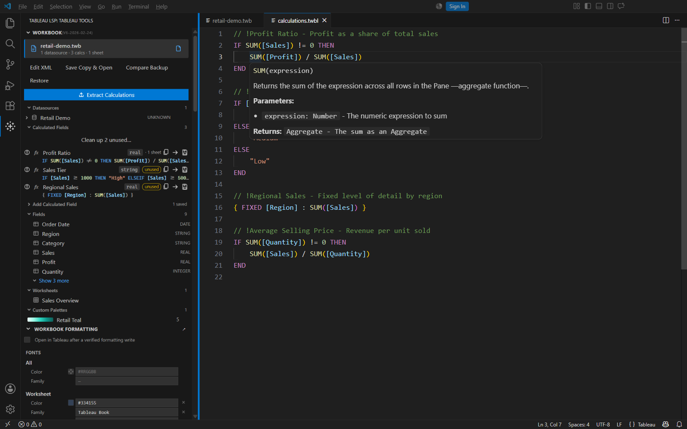
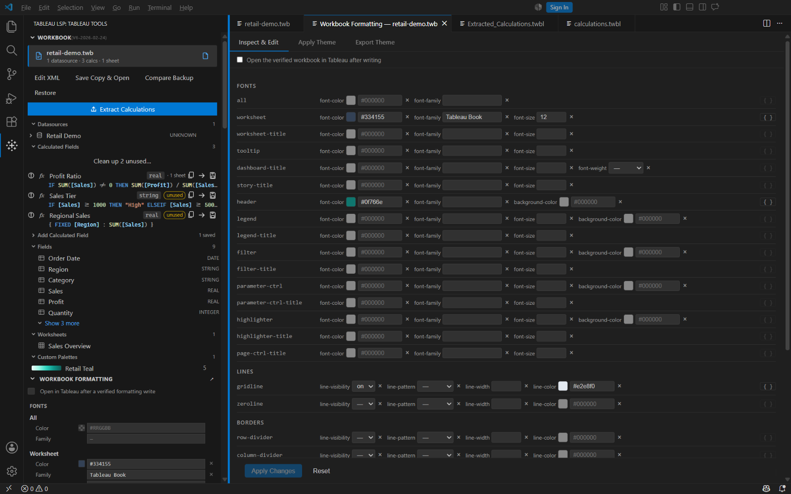

# User guide

[Installation and overview](../README.md) · [Screenshot walkthrough](../examples/README.md)

## Write calculations

Open a `.twbl` file. Completion suggests functions, keywords, and known fields; hover shows function signatures and field details. Use the Problems panel for supported syntax and semantic diagnostics.

Open a `.twb` or `.twbx` to supply its datasource fields to IntelliSense, hover, diagnostics, navigation, and field swapping. Qualified references such as `[Datasource].[Field]` help distinguish fields from different datasources.



Use **Tableau: Format Tableau Expression** to format the selection or the whole document. **Tableau: Select Calculation Formatting Profile** offers `readable`, `compact`, and `expanded` styles. Keyword case, line length, argument wrapping, operator position, and indentation are configurable.

```tableau
// !Profit Ratio - Profit as a share of total sales
IF SUM([Sales]) != 0 THEN
    SUM([Profit]) / SUM([Sales])
END
```

Markdown fences labeled `tableau` also receive syntax highlighting.

## Inspect and extract

Open **Tableau Tools** from the activity bar to browse the active workbook's datasources, calculated fields, fields, worksheets, and custom palettes.

Click **Extract Calculations**, or run **Tableau: Extract Calculations** with the workbook active. The command writes `Extracted_Calculations.twbl` in the workspace root and opens it. Extraction resolves internal field names to captions, normalizes formulas, and filters duplicate or trivial calculations. See the [Extraction Guide](extraction-guide.md).

## Edit and recover workbooks

Use **Tableau: Add Calculation to Workbook**, the sidebar's **Add Calculated Field** form, or `@tableau` to add a field to a `.twb` or `.twbx` datasource. A selection in a `.twbl` editor can supply the formula. Duplicate calculation names require explicit replacement; physical-field name collisions are rejected.

The form's **Common Calculations** library starts with a Profit Ratio example and stores up to ten reusable name, formula, and datatype templates. **Use Saved** fills the form; **Save Current** adds or updates a template. Templates participate in VS Code Settings Sync when available.

Extension-managed mutations validate XML, create a complete timestamped backup in `.tableau-lsp-backups`, and check the persisted result. Failed writes recover from the backup when safe; newer external edits are preserved and reported. Packaged edits replace only the embedded workbook and preserve the other archive entries. A package must contain exactly one workbook.

| Command | Behavior |
| --- | --- |
| **Edit Workbook XML** | Opens the embedded XML of a `.twbx` in a native editor; normal Save writes it back to the package. |
| **Save a Workbook Copy** | Includes unsaved editor changes and leaves the source unchanged. |
| **Save a Workbook Copy and Open in Tableau** | Saves a copy and launches it in the configured local Tableau installation. |
| **Compare Workbook with Backup** | Opens an XML diff against a saved backup. |
| **Restore Workbook Backup** | Restores an earlier version after backing up the current file, including a damaged file. |

Save or revert a dirty packaged XML editor before applying sidebar or chat edits. Keep a plain `.twb` copy beside its original when connections use relative paths. A `.twbx` copy retains packaged data and images; external connections still require access.

Verification checks XML, archive integrity, and saved contents. It does not prove that Tableau can resolve connections, evaluate every calculation, or render every sheet. Open the result in the intended Tableau Desktop version. Workbook version metadata is preserved; the extension does not downgrade workbooks.

## Format workbooks and create palettes

The sidebar and **Tableau: Open Formatting Panel** inspect and edit worksheet fonts, colors, borders, and line styles. They use the same backup and verification layer as other workbook edits.



- **Format Stripper** removes selected borders, bold, font sizes, and font colors, with scan counts before applying changes.
- **Palette Library** creates, edits, imports, archives, and applies categorical, sequential, and diverging palettes.
- **Gradient generators** support a base-color ramp or multiple color stops, configurable easing, and LAB, RGB, or HSL interpolation.
- **Theme Vault** stores named collections of palettes. Workbook formatting themes can also be imported and exported as JSON, with override or preserve-existing modes.

Workspace palettes live in `config/Preferences.tps`. **Copy Preferences.tps to My Tableau Repository** makes them available to the local Tableau repository.

The palette editor's **Save** updates its sidebar list. Use **File Actions → Save** to persist that list to `config/Preferences.tps`.

**Open in Tableau after a verified formatting write** launches the saved workbook in the configured or newest discovered Tableau Desktop installation. It does not close an already-running Tableau process.

## Reuse fields and calculations

Place shared files in a `tableau/` folder at a workspace root:

```text
tableau/
  fields.d.twbl       # Field declarations for IntelliSense
  retail.d.twbl       # Additional declarations, merged
  common.twbl         # Reusable calculations for the Calc Bank
  agent.md            # Project instructions for @tableau
```

A root-level `fields.d.twbl` also works. Configure additional folders through `tableau-language-support.fieldDefinitions.folders`. Live workbook fields take precedence over these fallback declarations.

The Calc Bank also accepts selections through **Tableau: Add Selection to Calc Bank**. The Calculation Portfolio supplies stock examples for insertion at the cursor.

## Use Copilot with a workbook

With Copilot Chat and an available model, ask `@tableau` about the active workbook. Commands include `/new`, `/borders`, `/calcs`, and `/fields`.

```text
@tableau /fields
@tableau what borders are set?
@tableau add a profit ratio calculation
```

Workbook context comes from a parsed digest. Calculation writes show a confirmation card with the proposed formula and use the backup and verification workflow. Agent mode can access the complete field inventory through `#tableauFields` and propose a calculation through `#tableauAddCalculation`.

Project `agent.md`, `instructions.md`, and `*.agent.md` files in the configured library folders accompany `@tableau` requests. Use **Tableau: Create Agent Instructions for @tableau** to scaffold naming and datasource conventions. Project guidance cannot override the built-in safety rules.

## Connect local Tableau Desktop

| Command | Purpose |
| --- | --- |
| **Connect Local Workbook to LSP and Chat** | Attaches a `.twb` or `.twbx` outside the workspace to the shared field model. |
| **Open Workbook in Local Tableau Desktop** | Launches the active or selected workbook. |
| **Show Local Connector Status** | Reports discovered Desktop versions, repositories, workbooks, datasources, connectors, extracts, and logs. |
| **Open Local Tableau Repository** | Opens the detected repository in the operating system. |

The connector discovers standard and OneDrive-backed repository folders and uses local Tableau files. Override repository and executable paths with `tableau-language-support.local.*` settings.

## Settings and troubleshooting

Search VS Code Settings for `tableau-language-support`:

- `enableFormatting` and `enableSignatureHelp` toggle their providers.
- `formatting.*` controls calculation layout and casing.
- `fieldDefinitions.folders` selects shared library folders.
- `local.*` controls local discovery and launch paths.

If language features stop responding, check that the editor language is **Tableau**, then run **Tableau: Restart Language Server**. **Tableau: Show Extension Status** and **Tableau: Show Logs** provide diagnostics. Disable any duplicate Tableau language extension if VS Code reports a conflict.

## Develop from source

Use the checks in the [README](../README.md#development), then follow the [debug and reload workflow](AUTO_RELOAD_DEBUGGER.md). Development commands such as **Compile and Reload Tableau Debugger** require a source checkout and an Extension Development Host.

To update a clean checkout from GitHub on Windows, run `./Update-FromGitHub.ps1`. It fetches `origin`, switches to `main`, and performs a fast-forward-only pull. It refuses tracked local changes and leaves untracked workbook fixtures in place. Use `-Remote` and `-Branch` to select another source.
