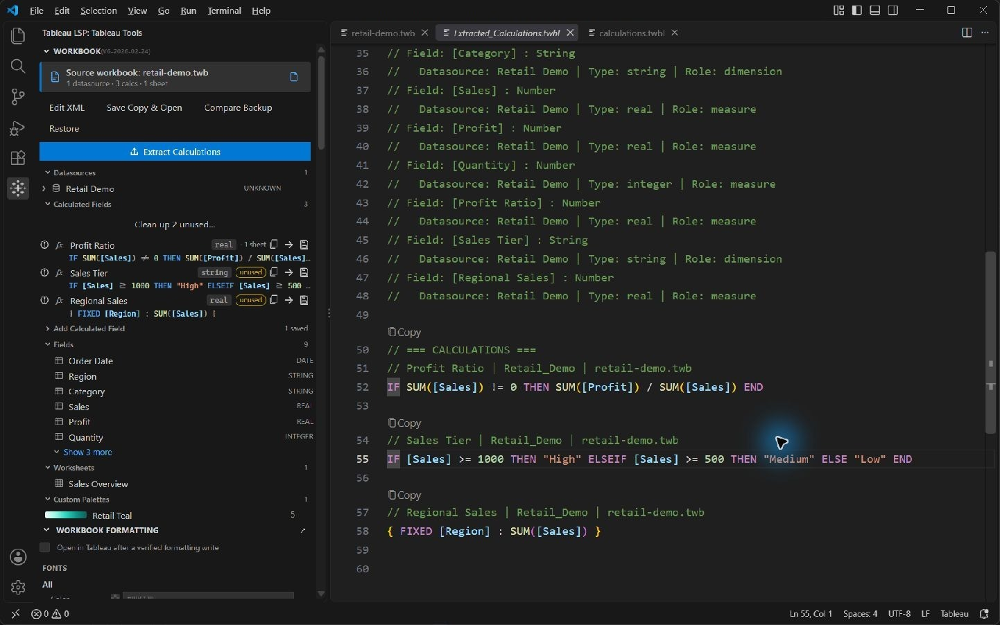
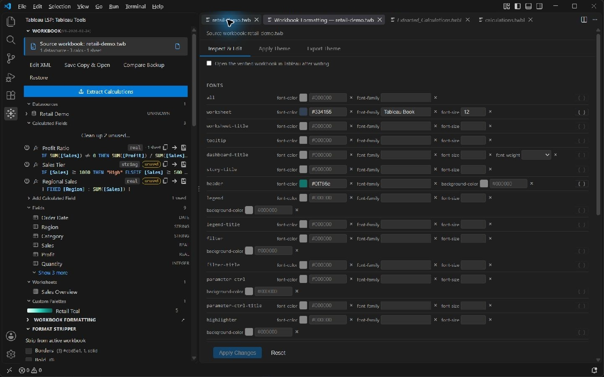
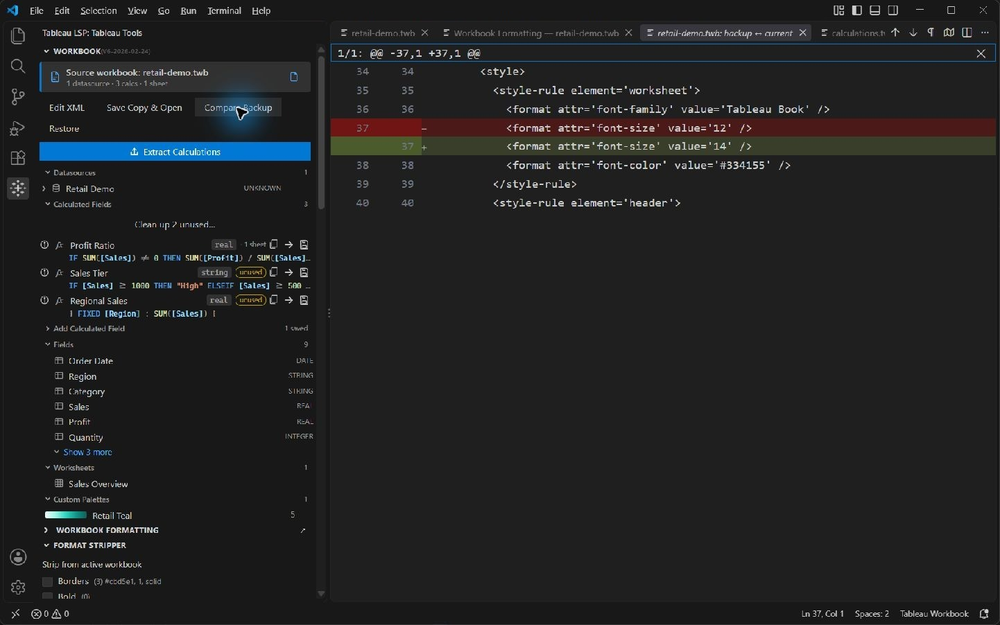

# Screenshot walkthrough

The five demo captures below show the released **Tableau Language Support 1.14.0** VSIX installed in **VS Code 1.138.0 on Windows**, taken on September 20, 2026. The title shows **1.14.0 / demo**. The separate agent-tool example also shows 1.14.0 and is described below.

The included files contain synthetic fields, calculations, formatting, and palettes. The workbook is an extension demonstration fixture without a live data connection; Tableau Desktop rendering was not verified.

## Open the demo

1. Install the [latest GitHub VSIX](https://github.com/TrueCrimeDev/Tableau-LSP/releases/latest) or build the extension from source. The agent XML tools require version 1.14.0 or newer.
2. Copy this folder to a scratch location and open [Tableau Demo.code-workspace](Tableau%20Demo.code-workspace) in VS Code.
3. Open [retail-demo.twb](retail-demo.twb), then select **Tableau LSP** in the activity bar to show **Tableau Tools**.

The starting workbook has one datasource, nine fields including three calculated fields, one worksheet, and a custom palette. The screenshots show successive steps using a working copy; the files here provide the starting state.

## Test without Tableau

No Tableau installation or account is needed for these checks. Use your normal VS Code profile for live AI tests so your configured Chat model is available.

1. Open `retail-demo.twb` and confirm the sidebar lists **Retail Demo**, **Sales Overview**, and the three calculated fields. Open `calculations.twbl` to try field completion and function hover help.
2. Follow **Add a calculated field** below, then use **Compare Backup**. Confirm the new calculation appears in the saved XML and the diff, with a backup in `.tableau-lsp-backups`.
3. For the AI/XML workflow, select `retail-demo.twb` and send this in Chat:

   ```text
   @tableau Change the worksheet font size in Sales Overview from 12 to 14.
   Show the XML change before applying it, then save a copy named retail-demo-test.twb.
   Do not open Tableau.
   ```

4. Review the confirmation, then check that the worksheet's `font-size` value is `14` in both the edited source and exported copy. Use **Compare Backup** to see the change from `12`. If you are testing without Chat, make the formatting change in **Tableau: Open Formatting Panel**, then use **Save a Workbook Copy**.
5. Restore the earlier backup and confirm the original value returns. Choose a new export filename when repeating the test; existing copies are not overwritten.

Use a fresh scratch copy for another run. Avoid the bare `@tableau /export` shortcut for this test because it also requests opening Tableau. Live AI tests need an accessible Chat model; the manual checks do not.

For automated verification, run `npm test` from the repository root after `npm ci`. It runs TypeScript, unit, deterministic workbook, and real VS Code extension-host checks without launching Tableau. For source debugging, F5 with **Run Extension (synthetic demo)** builds and opens an isolated demo profile.

These checks establish the extension's behavior and saved file contents. Actual Tableau chart rendering, data connections, and calculation evaluation must be checked on your Tableau work computer.

## Calculation completion

Open [calculations.twbl](calculations.twbl), place the cursor inside `SUM`, and run **Trigger Suggest** to see matching functions. The inspector retains the workbook's field context while you edit calculations. **Show Hover** displays function documentation.


## Extract calculations

Activate `retail-demo.twb` and run **Tableau: Extract Calculations** from the Command Palette. The generated `Extracted_Calculations.twbl` contains one datasource, nine fields, three calculations, and one worksheet. The capture shows its fields and normalized formulas.

The sidebar's **Extract Calculations** button instead writes the smaller `_Calculations.notes` file beside the workbook; it does not automatically open that file.



## Inspect formatting

With the workbook active, run **Tableau: Open Formatting Panel**. Inspect fonts, colors, gridlines, and borders. The **Apply Theme** and **Export Theme** tabs handle formatting themes. This capture shows the original worksheet font size of **12**.



Change the worksheet font size to **14**, leave **Open the verified workbook in Tableau after writing** unchecked, and click **Apply Changes**. The demonstrated run saved the `font-size` value as **14** and created an exact copy of the original workbook in `.tableau-lsp-backups`.

Click **Compare Backup**, choose that backup, and press **F7** for the accessible diff view. The saved change from **12** to **14** appears below; the sidebar still identifies the original workbook.



## Generate and save a palette

1. Collapse **Workbook**, **Workbook Formatting**, and **Format Stripper** to make room for **Palette Library**.
2. Select **Retail Teal**. In **Advanced Gradient Generator**, use base color `#5CB8B2`, nine steps, and **Ease Out**.
3. Click **Generate**, then the arrow beside the preview to load the colors into the palette editor.
4. Click **Save Palette to File** to write the palette and library to `config/Preferences.tps`.

The capture shows **No unsaved palette changes**, the save confirmation, and all nine persisted colors in `Preferences.tps`. The other two palettes remain in the file.


## Add a calculated field

Expand **Workbook → Add Calculated Field**. Choose **Retail Demo**, name the field **Average Selling Price**, select **Number (real)**, and enter:

```tableau
IF SUM([Quantity]) != 0 THEN
    SUM([Sales]) / SUM([Quantity])
END
```

Click **Add to Workbook**, then **Compare Backup** to inspect the new `<column>` and `<calculation>`. This optional exercise starts from a fresh copy; the current screenshots demonstrate the formatting edit above.

## Edit underlying XML with the agent tools

In version 1.14.0, `@tableau /edit` can read and modify exact XML inside a `.twb` or `.twbx`. `@tableau /export` saves a separate copy and requests opening it in Tableau Desktop.

This real 1.14.0 capture shows an edit made through the registered XML tool after its before/after confirmation was accepted. A disposable copy of Tableau's bundled Superstore sample was used; that workbook is not distributed in this repository. The datasource caption changed while the source workbook remained selected in the sidebar.


The registered export tool also saved the edited package and launched Tableau. Tableau Desktop 2026.1 stopped at license activation, so this capture proves the persisted extension edit, not Tableau rendering.

## Verification

On September 20, typechecking and **1,058 unit tests** passed for the 1.14.0 source, and the released package passed **42 installed-VSIX checks**. Extraction outputs, the formatting edit and its backup, and all saved palette colors were also checked on disk after the interactive steps. See the [1.14.0 review](../docs/review-1.14.0.md#screenshot-refresh--september-20-2026) for the package checksum and verification limits.
