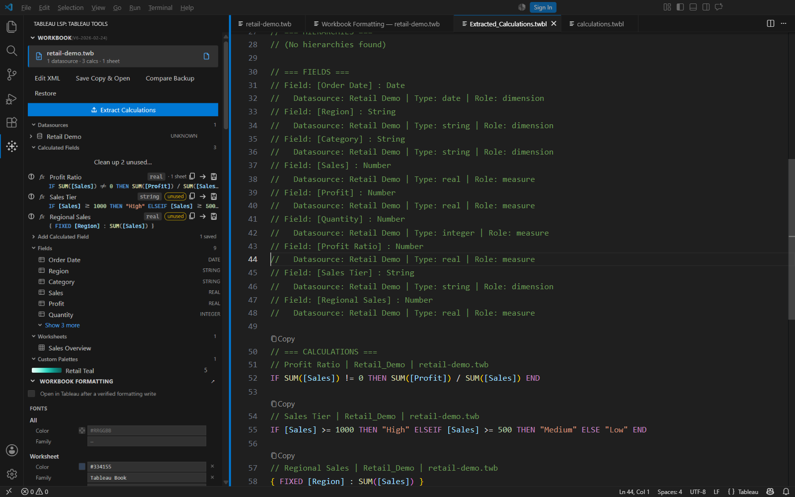
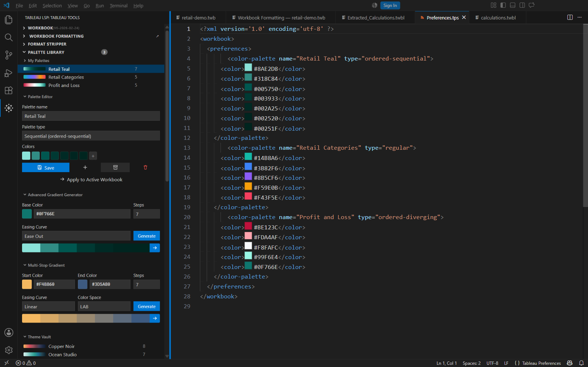
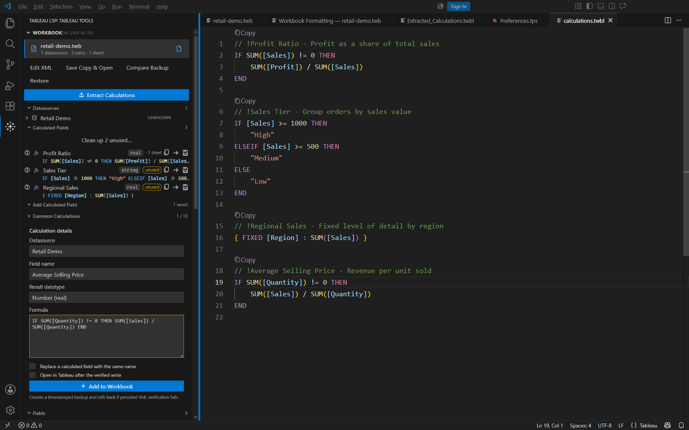
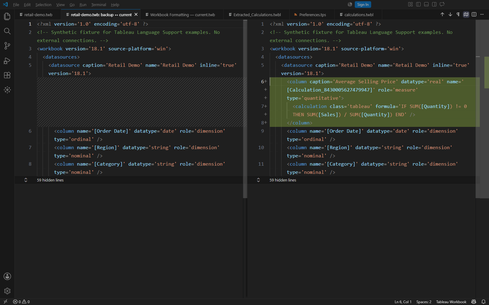
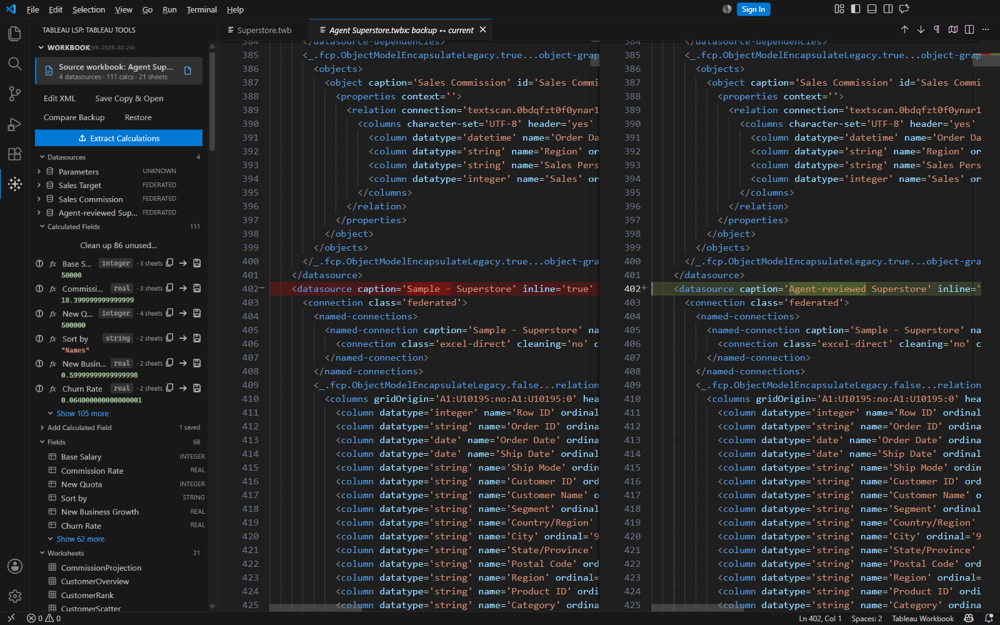

# Screenshot walkthrough

These are actual captures of **Tableau Language Support 1.13.1** running in a **VS Code 1.138.0 Extension Development Host on Windows**, taken on September 19, 2026. The window title identifies the demo as **demo**.

The included files contain synthetic fields, calculations, formatting, and palettes. The workbook is an extension demonstration fixture without a live data connection; Tableau Desktop rendering was not verified.

## Open the demo

1. Install the [latest GitHub VSIX](https://github.com/TrueCrimeDev/Tableau-LSP/releases/latest) or build the extension from source. The agent XML tools require version 1.14.0 or newer.
2. Copy this folder to a scratch location and open [Tableau Demo.code-workspace](Tableau%20Demo.code-workspace) in VS Code.
3. Open [retail-demo.twb](retail-demo.twb), then select **Tableau LSP** in the activity bar to show **Tableau Tools**.

The starting workbook has one datasource, nine fields including three calculated fields, one worksheet, and a custom palette. The screenshots show successive steps using a working copy; the files here provide the starting state.

## Test without Tableau

No Tableau installation or account is needed for these checks. Use your normal VS Code profile for live AI tests so your configured Chat model is available.

1. Open `retail-demo.twb` and confirm the sidebar lists **Retail Demo**, **Sales Overview**, and the three calculated fields. Open `calculations.twbl` to try field completion and function hover help.
2. Follow **Add a calculated field** below, then use **Compare Backup**. Confirm the new calculation appears in the saved XML and the diff, with a backup in `.tableau-lsp-backups`.
3. For the AI/XML workflow, select `retail-demo.twb` and send this in Chat:

   ```text
   @tableau Change the worksheet font size in Sales Overview from 12 to 14.
   Show the XML change before applying it, then save a copy named retail-demo-test.twb.
   Do not open Tableau.
   ```

4. Review the confirmation, then check that the worksheet's `font-size` value is `14` in both the edited source and exported copy. Use **Compare Backup** to see the change from `12`. If you are testing without Chat, make the formatting change in **Tableau: Open Formatting Panel**, then use **Save a Workbook Copy**.
5. Restore the earlier backup and confirm the original value returns. Choose a new export filename when repeating the test; existing copies are not overwritten.

Use a fresh scratch copy for another run. Avoid the bare `@tableau /export` shortcut for this test because it also requests opening Tableau. Live AI tests need an accessible Chat model; the manual checks do not.

For automated verification, run `npm test` from the repository root after `npm ci`. It runs TypeScript, unit, deterministic workbook, and real VS Code extension-host checks without launching Tableau. For source debugging, F5 with **Run Extension (synthetic demo)** builds and opens an isolated demo profile.

These checks establish the extension's behavior and saved file contents. Actual Tableau chart rendering, data connections, and calculation evaluation must be checked on your Tableau work computer.

## Calculation help

Open [calculations.twbl](calculations.twbl), place the cursor inside `SUM`, and hover or run **Show Hover**. The inspector retains the workbook's field context while you edit calculations.


## Extract calculations

Activate `retail-demo.twb` and click **Extract Calculations**. The generated `Extracted_Calculations.twbl` contains the datasource inventory, field types, and normalized formulas. This capture shows the generated fields and calculations.



## Inspect formatting

With the workbook active, run **Tableau: Open Formatting Panel**. Inspect the worksheet font, header color, gridlines, and borders. The **Apply Theme** and **Export Theme** tabs handle formatting themes.


## Generate and save a palette

1. Collapse **Workbook**, **Workbook Formatting**, and **Format Stripper** to make room for **Palette Library**.
2. Select **Retail Teal**. In **Advanced Gradient Generator**, set the base color to `#0F766E`, use seven steps, and select **Ease Out**.
3. Click **Generate**, then the arrow beside the preview to load the colors into the palette editor.
4. Click **Save Palette to File** to write the palette and library to `config/Preferences.tps`.

The 1.13.1 capture below shows the earlier two-step Save flow. Version 1.14.0 combines those steps in **Save Palette to File** and displays unsaved status.



## Add a calculated field

Expand **Workbook → Add Calculated Field**. Choose **Retail Demo**, name the field **Average Selling Price**, select **Number (real)**, and enter:

```tableau
IF SUM([Quantity]) != 0 THEN
    SUM([Sales]) / SUM([Quantity])
END
```

This capture shows the completed form before clicking **Add to Workbook**.



After submission, the demo's saved XML contained the new field and its formula, and `.tableau-lsp-backups` contained a copy of the original workbook.

## Compare the saved change

Click **Compare Backup**, choose the generated backup, and inspect the native VS Code diff. The new `<column>` and `<calculation>` are highlighted in green. Version 1.14.0 retains the original workbook as the source while the diff is active.



## Edit underlying XML with the agent tools

In version 1.14.0, `@tableau /edit` can read and modify exact XML inside a `.twb` or `.twbx`. `@tableau /export` saves a separate copy and requests opening it in Tableau Desktop.

This real 1.14.0 capture shows an edit made through the registered XML tool after its before/after confirmation was accepted. A disposable copy of Tableau's bundled Superstore sample was used; that workbook is not distributed in this repository. The datasource caption changed while the source workbook remained selected in the sidebar.



The registered export tool also saved the edited package and launched Tableau. Tableau Desktop 2026.1 stopped at license activation, so this capture proves the persisted extension edit, not Tableau rendering.

## Verification

The original 1.13.1 review passed 996 unit tests, 44 deterministic tests, and 22 real extension-host checks, with a teardown warning documented in its [review notes](../docs/review-2026-09-19.md). The [1.14.0 review](../docs/review-1.14.0.md) covers the timer fix, five agent tools, stricter XML checks, installed-package tests, and current verification limits.
